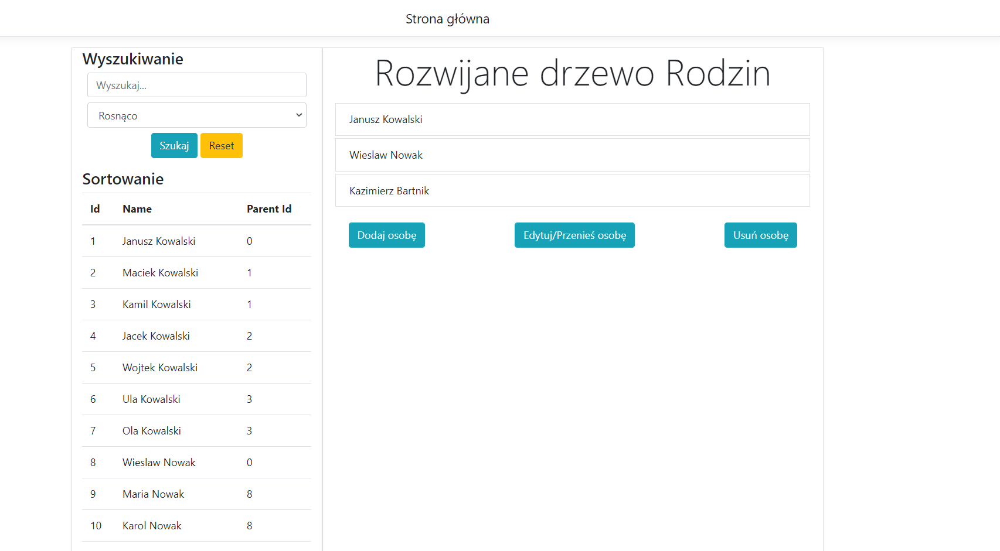
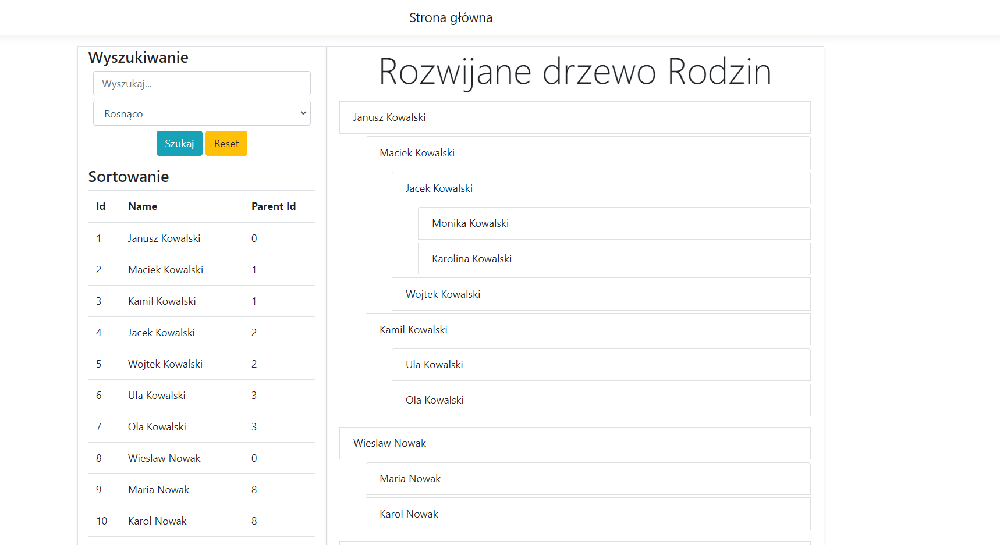
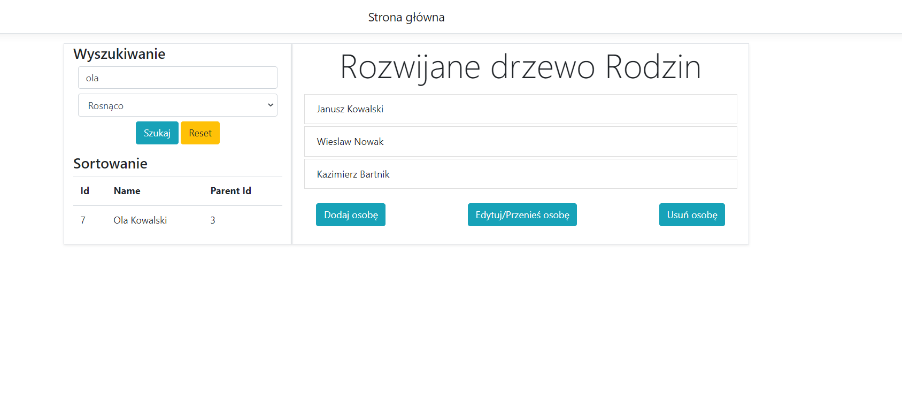
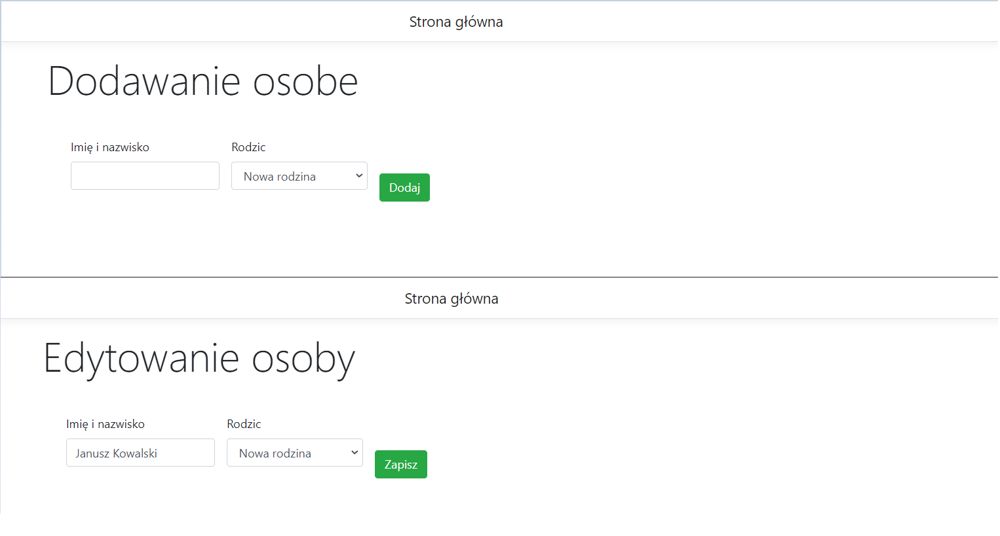

# DominikFamilyTree

## General info
In left side we have all people from database. We can search person by name, and sort from ascending and descending.  
In right side we have tree. We can expand all familys.  
On down we see 3 buttons. We can there: add new person, edit or delete. We also can transfer person to another family.   

## Screenshots
Example 1 Main Side

Example 2 Expand tree

Example 3 Search by name person

Example 4 Add/Edit person

## Technologies
ASP.NET CORE MVC 

Backend: .NET CORE  
Database: MSSql 
Frontend: Bootstrap/js 

## Setup
Describe how to install / setup your local environement / add link to demo version.

## Controller do:
Search, sort, add, edit, delete, check exist
